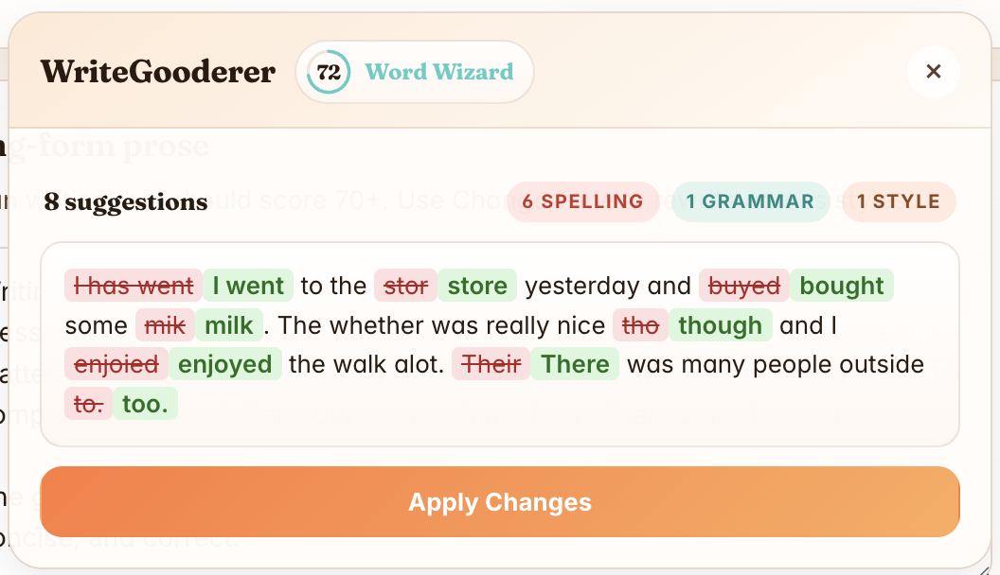

# WriteGooderer

A Chrome extension that proofreads and rewrites text in the page you're already typing in. Runs on Chrome's built-in, on-device AI (Gemini Nano via the Prompt API). Nothing you type leaves the browser.

Click into a text field, a floating `W` appears. From there you can proofread, see a score for the current text, or rewrite it in a different tone.

## Install

1. Clone this repo: `git clone https://github.com/victorhuangwq/WriteGooderer.git`
2. Open `chrome://extensions` and turn on **Developer mode**
3. Click **Load unpacked** and select the `dist/` folder

See [Requirements](#requirements) if the popup says the Prompt API is unavailable.

## What It Does

- Catches grammar, spelling, punctuation, and clarity issues
- Assigns a Gooderness score from `0` to `100`
- Shows inline, diff-style corrections before anything is applied
- Rewrites selections in preset tones: Professional, Friendly, LinkedIn Influencer, Passive Aggressive
- Remembers your last tone and any sites you've muted it on
- Runs on-device through Chrome's Prompt API

## Requirements

- Chrome `138+`
- A Chrome build that ships the Prompt API
- The Gemini Nano model downloaded locally

If the popup tells you the Prompt API is unavailable:

1. Open `chrome://flags`
2. Enable `Prompt API for Gemini Nano`
3. Open `chrome://components`
4. Update the on-device model if Chrome hasn't already pulled it down

## How It Works

Session management is done by [`simple-chromium-ai`](https://www.npmjs.com/package/simple-chromium-ai), which wraps the Prompt API with cloning and structured JSON responses. Sessions are prewarmed, cloned per request, and destroyed when the proofread or rewrite finishes.

Code layout:

- `src/content/`: floating button and in-page card UI
- `src/popup/`: extension action popup
- `src/background/`: MV3 service worker
- `src/shared/`: prompts, storage helpers, types, score/tone constants

## Using it

1. Click into a supported field; the floating `W` shows up
2. Open the card to proofread or pick a tone
3. Look over the diff or the rewritten version
4. Apply it back into the field

## Contributing

See [CONTRIBUTING.md](CONTRIBUTING.md) for setup, dev commands, and PR guidelines, and [CODE_OF_CONDUCT.md](CODE_OF_CONDUCT.md) for community expectations.

## License

[MIT License](LICENSE).
